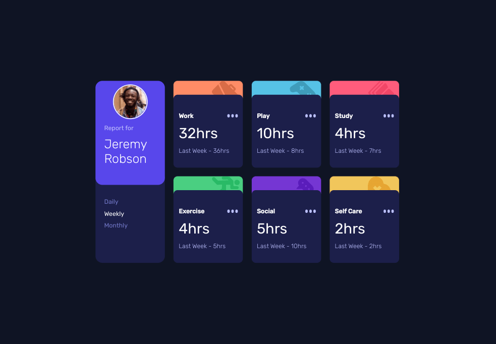
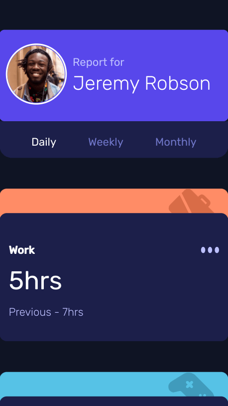

# Frontend Mentor - Time tracking dashboard solution

This is a solution to the [Time tracking dashboard challenge on Frontend Mentor](https://www.frontendmentor.io/challenges/time-tracking-dashboard-UIQ7167Jw). Frontend Mentor challenges help you improve your coding skills by building realistic projects.

## Table of contents

- [Overview](#overview)
  - [The challenge](#the-challenge)
  - [Screenshot](#screenshot)
  - [Links](#links)
- [My process](#my-process)
  - [Built with](#built-with)
  - [What I learned](#what-i-learned)
  - [Continued development](#continued-development)
  - [Useful resources](#useful-resources)

## Overview

### The challenge

Users should be able to:

- View the optimal layout for the site depending on their device's screen size
- See hover states for all interactive elements on the page
- Switch between viewing Daily, Weekly, and Monthly stats

### Screenshot

### Links

- Live Site URL: [Github Pages](https://jdegand.github.io/time-tracking-dashboard)

## My process

### Built with

- CSS custom properties
- Flexbox
- Grid

### What I learned

- Need local server to use fetch on local file.  

### Continued development

- Accessibility / Improved Semantic HTML5 markup
- Account for hours vs hour
- Repetitive code reduction
- Better to use a framework?

### Useful resources

- [Stack Overflow](https://stackoverflow.com/questions/53823706/expected-a-json-object-array-or-literal-json) - JSON formatting
- [Stack Overflow](https://stackoverflow.com/questions/49481934/fetching-local-json) - Fetching local json
- [JS Fiddle](https://jsfiddle.net/petrabarus/pPgS7/) - radio buttons
- [Stack Overflow](https://stackoverflow.com/questions/5723647/change-data-based-on-radio-button) - change data based on radio buttton
- [JS Tutorial](https://www.javascripttutorial.net/javascript-dom/javascript-radio-button/) - radio buttons
